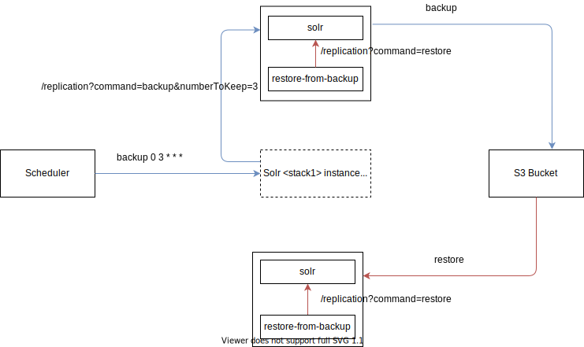

## Solr Backup and Restore

When using this backup/restore mechanism, Solr's replication handler is using Caringo Swarm as the storage layer for the backups. The implementation of the new backend repository is [here](https://github.com/xenit-eu/solr-backup).

Taking a backup is outside the scope of this image.

Restore is done via an init script in solr image, which checks the need of restore (variable + existence of index), starts solr without tracking, does the restore and restarts solr with tracking enabled. Snapshot's name can be specified via a variable or detected as the latest snapshot in the bucket.

| Variable            | Default                              | Comments                                                                                                   |
|---------------------|--------------------------------------|------------------------------------------------------------------------------------------------------------|
| RESTORE_FROM_BACKUP | none                                 | Whether to attempt a restore from backup at startup                                                        |
| RESTORE_BACKUP_NAME | none                                 | If provided, restores from that specific snapshot. If not provided, it's the last snapshot from the bucket.|
| RESTORE_BACKUP_PATH | none                                 | S3 location in bucket to solr-snapshot, combined with RESTORE_BACKUP_NAME.                                 |
| S3_ENDPOINT         | http://s3.eu-central-1.amazonaws.com | S3 endpoint                                                                                                |
| S3_BUCKET_NAME      | test-bucket                          | S3 bucket                                                                                                  |
| S3_REGION           | eu-central-1                         | S3 bucket region                                                                                           |
| S3_ACCESS_KEY       | none                                 | S3 access key                                                                                              |
| S3_SECRET_KEY       | none                                 | S3 secret key                                                                                              |

### Communication via SSL
In case communication to Solr requires mtls, certificates needed should be included in the backup container and in solr image. A set of default certificates is provided.